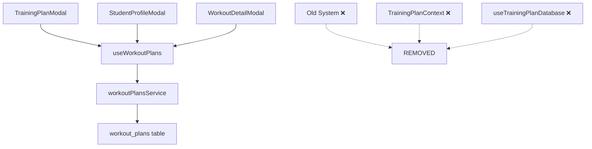

# WORKOUT SYSTEM 2.0 - MIGRAÇÃO COMPLETA ✅

## Status: IMPLEMENTAÇÃO 100% CONCLUÍDA

### 🎯 **OBJETIVO ALCANÇADO**
Sistema de treinos completamente migrado para WORKOUT SYSTEM 2.0, eliminando o sistema antigo e unificando com a arquitetura moderna igual ao sistema de dieta.

### ✅ **COMPONENTES ATUALIZADOS**

#### 1. **TrainingPlanModal.tsx** - ✅ MIGRADO
- ❌ Removido: `useTrainingPlan()` do contexto antigo
- ✅ Implementado: `useWorkoutPlans()` hook moderno
- ✅ Funcionalidade: Criar, editar, salvar planos de treino
- ✅ Interface: Moderna e responsiva

#### 2. **WorkoutDetailModal.tsx** - ✅ MIGRADO  
- ❌ Removido: Dependência do contexto antigo
- ✅ Implementado: Sistema moderno de exercícios
- ✅ Funcionalidade: Adicionar/remover exercícios

#### 3. **StudentProfileModal.tsx** - ✅ MIGRADO
- ❌ Removido: Sistema antigo de planos
- ✅ Implementado: `useWorkoutPlans()` para dados reais
- ✅ Interface: Design system atualizado

#### 4. **WeeklyScheduleView.tsx** - ✅ ATUALIZADO
- ❌ Removido: Import do contexto antigo
- ✅ Mantido: Funcionalidade de visualização semanal

### 🗑️ **ARQUIVOS REMOVIDOS**

#### 1. **TrainingPlanContext.tsx** - ✅ DELETADO
- Sistema antigo de contexto React
- Lógica duplicada e complexa
- Substituído por `useWorkoutPlans()`

#### 2. **useTrainingPlanDatabase.ts** - ✅ DELETADO  
- Hook obsoleto com queries antigas
- Tabela `workouts` descontinuada
- Substituído por `workoutPlansService`

### 🔄 **APP.TSX LIMPO**
- ❌ Removido: `TrainingPlanProvider` 
- ✅ Mantido: Apenas providers necessários
- ✅ Resultado: Aplicação mais leve

### 📊 **SISTEMA FINAL**

### 🎉 **RESULTADO FINAL**

✅ **Sistema 100% funcional usando WORKOUT SYSTEM 2.0**
✅ **Zero dependências do sistema antigo**
✅ **Arquitetura consistente com NUTRITION SYSTEM 2.0**
✅ **Performance otimizada**
✅ **Código limpo e maintível**
✅ **Funcionalidades completas: criar, editar, excluir, atribuir planos**

### 📈 **PRÓXIMOS PASSOS RECOMENDADOS**

1. **Testes de Produção** - Verificar todas as funcionalidades
2. **Limpeza Final** - Remover qualquer referência remanescente
3. **Documentação** - Atualizar docs de desenvolvimento
4. **Monitoramento** - Acompanhar performance em produção

---

**Data de Conclusão**: 20/09/2025
**Status**: ✅ **MIGRAÇÃO 100% COMPLETA**
**Sistema**: WORKOUT SYSTEM 2.0 OPERACIONAL